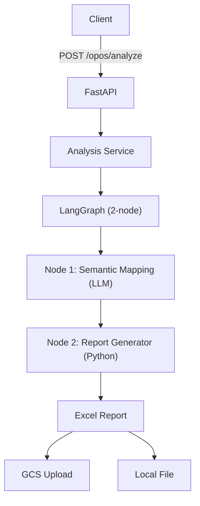
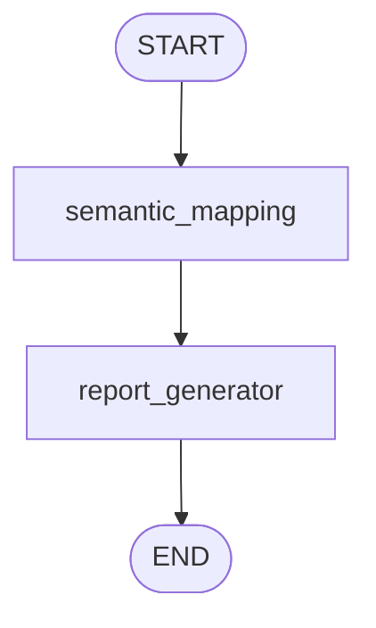
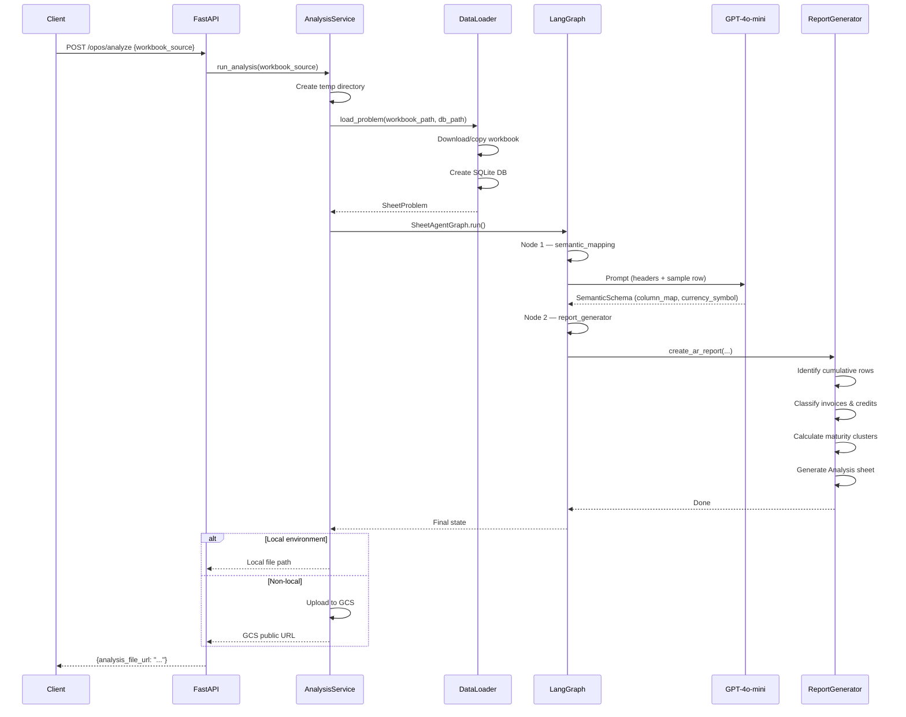
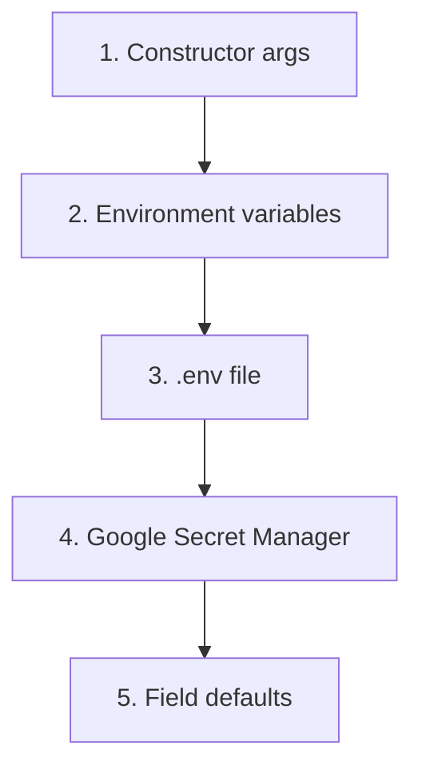

# Architecture

This document details the technical design of SheetAgent, including component responsibilities, data flow, and the rationale behind key decisions.

## Design Philosophy

SheetAgent separates **semantic understanding** (LLM) from **numerical computation** (deterministic Python). The LLM is called exactly once per analysis to map column names; all arithmetic, classification, and report formatting is pure Python. This yields:

- **Reproducibility** — identical inputs produce identical outputs.
- **Cost efficiency** — a single GPT-4o-mini call with structured output.
- **Testability** — business logic is unit-testable without LLM mocking.

## System Overview



## Component Breakdown

### API Layer

| File | Responsibility |
|------|----------------|
| `app/app.py` | FastAPI application factory with lifespan, exception handler, and router registration |
| `app/api/endpoints/health.py` | Liveness (`/health`) and readiness (`/ready`) probes |
| `app/api/endpoints/opos.py` | `POST /opos/analyze` — validates request, calls `run_analysis`, returns result |

### Service Layer

| File | Responsibility |
|------|----------------|
| `app/services/analysis_service.py` | Orchestrates the workflow: creates temp directories, loads the workbook, runs the graph, handles output (local save or GCS upload) |

### Graph Layer (LangGraph)

The workflow is a **linear 2-node StateGraph** with no branching or loops.



| File | Responsibility |
|------|----------------|
| `app/graph/graph.py` | Defines both nodes, builds and compiles the `StateGraph`, provides the `SheetAgentGraph` wrapper class |
| `app/graph/state.py` | `GraphState` TypedDict — carries `problem`, `output_dir`, `reporting_date`, `column_map`, `currency_symbol`, and `messages` |

#### Node 1 — Semantic Mapping

- Reads the Excel file to extract column headers and a sample data row.
- Constructs a prompt via `PromptManager` with the headers and sample data.
- Calls GPT-4o-mini with `with_structured_output(SemanticSchema)` to enforce a typed response.
- Populates `column_map` and `currency_symbol` in the graph state.

#### Node 2 — Report Generator

- Receives the `column_map` and `currency_symbol` from Node 1.
- Copies the input workbook to the output directory.
- Calls `create_ar_report` which performs:
  - Cumulative row detection (running-sum matching + keyword checks).
  - Invoice classification (positive amounts with posting dates).
  - Credit classification (negative amounts with document types).
  - Maturity calculation: `(due_date - reporting_date).days`.
  - Cluster assignment: "Not mature", "1–30 days", "31–60 days", ">60 days".
  - Aggregation into a formatted Analysis sheet.

### Core Modules

| File | Responsibility |
|------|----------------|
| `app/core/config.py` | `SheetAgentSettings` (Pydantic BaseSettings) — loads from `.env`, environment variables, and Google Secret Manager for non-local environments |
| `app/core/logging_config.py` | Centralised logging setup with consistent formatting |
| `app/core/prompt_manager.py` | System and user prompt templates for the semantic mapping task |
| `app/core/report_generator.py` | All deterministic business logic: row identification, maturity calculations, Excel sheet creation and formatting |

### Data Layer

| File | Responsibility |
|------|----------------|
| `app/dataset/dataloader.py` | `load_problem` — downloads or copies the workbook, creates a SQLite mirror of all sheets, returns a `SheetProblem` |

### Utilities

| File | Responsibility |
|------|----------------|
| `app/utils/semantic_schema.py` | `SemanticSchema` Pydantic model — enforces structured output from the LLM |
| `app/utils/gcs.py` | `upload_to_gcs` — uploads the output file to Google Cloud Storage and returns the public URL |

## Execution Flow



## Configuration Sources

Settings are resolved in this priority order (highest first):



In non-local environments (`dev`, `prod`), the `GoogleSecretManagerSource` attempts to load each setting field from GCP Secret Manager. This allows secrets to be managed centrally without storing them in `.env` files deployed to cloud infrastructure.

## API Reference

### `POST /opos/analyze`

Analyzes an A/R open posts workbook and returns the enriched report.

**Request Body:**

```json
{
  "workbook_source": "https://example.com/opos.xlsx"
}
```

`workbook_source` accepts a URL (`http`/`https`) or a local file path to an Excel file (`.xlsx`, `.xls`).

**Response:**

```json
{
  "analysis_file_url": "https://storage.googleapis.com/bucket/analysis/uuid.xlsx"
}
```

In local environments, `analysis_file_url` contains a success message with the local path.

### `GET /api/v1/health`

Returns `{"status": "ok"}` if the process is running.

### `GET /api/v1/ready`

Returns `{"status": "ready"}` if the application has completed initialisation. Returns 503 otherwise.
