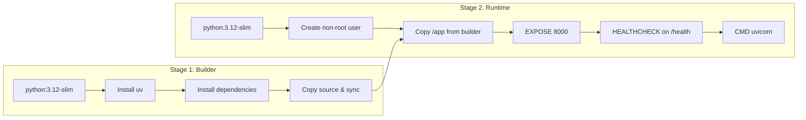

# Deployment

This document covers deploying SheetAgent to production environments, environment-specific configuration, and deployment strategies for viable platforms.

## Environment Configuration

SheetAgent uses a three-tier environment model controlled by the `APP_ENVIRONMENT` variable:

| Environment | Value | Secret Source | Output Destination |
|-------------|-------|---------------|-------------------|
| Local | `local` | `.env` file | Local filesystem (`./output/`) |
| Development | `dev` | GCP Secret Manager + `.env` fallback | Google Cloud Storage |
| Production | `prod` | GCP Secret Manager | Google Cloud Storage |

### Required Environment Variables

| Variable | Required | Description |
|----------|----------|-------------|
| `OPENAI_API_KEY` | Always | OpenAI API key for semantic mapping |
| `OPENAI_API_BASE` | Always | OpenAI API base URL |
| `APP_ENVIRONMENT` | Always | `local`, `dev`, or `prod` |
| `GCS_BUCKET_NAME` | Non-local | GCS bucket for output files |
| `SECRET_PROJECT_ID` | Non-local | GCP project ID for Secret Manager |
| `GOOGLE_APPLICATION_CREDENTIALS` | Non-local | Path to GCP service account key |
| `LANGSMITH_TRACING` | Optional | Enable LangSmith tracing (`true`/`false`) |
| `LANGSMITH_API_KEY` | If tracing | LangSmith API key |
| `LANGSMITH_ENDPOINT` | If tracing | LangSmith endpoint URL |
| `LANGSMITH_PROJECT` | If tracing | LangSmith project name |

## Docker Production Build

The Dockerfile uses a multi-stage build to keep the runtime image minimal:



Build the production image:

```bash
docker build -t sheetagent:latest .
```

Run the production container:

```bash
docker run -d \
  --name sheetagent \
  -p 8000:8000 \
  --env-file .env \
  -e APP_ENVIRONMENT=prod \
  -v ./credentials.json:/app/credentials.json:ro \
  sheetagent:latest
```

### Security Considerations

- The container runs as a non-root user (`sheetagent`, UID/GID assigned by `groupadd`/`useradd`).
- GCP credentials are mounted read-only.
- A `HEALTHCHECK` instruction validates the `/api/v1/health` endpoint every 30 seconds.

## Deployment Strategies

### Google Cloud Run (Recommended)

Cloud Run is the most natural fit: the application is a stateless HTTP service containerised with Docker.

1. Push the image to Artifact Registry:
   ```bash
   gcloud builds submit --tag gcr.io/PROJECT_ID/sheetagent
   ```
2. Deploy:
   ```bash
   gcloud run deploy sheetagent \
     --image gcr.io/PROJECT_ID/sheetagent \
     --platform managed \
     --region europe-west1 \
     --set-env-vars APP_ENVIRONMENT=prod \
     --set-secrets OPENAI_API_KEY=OPENAI_API_KEY:latest
   ```
3. Cloud Run natively supports GCP Secret Manager via `--set-secrets`.

### Render

1. Connect the GitHub repository to a Render Web Service.
2. Set the build command to `docker build -t sheetagent .`.
3. Set environment variables via the Render dashboard.
4. Render auto-deploys on push to `main`.

### Fly.io

1. Install the Fly CLI and run `fly launch` in the repo root.
2. Set secrets: `fly secrets set OPENAI_API_KEY=sk-...`.
3. Deploy: `fly deploy`.

## Production vs. Development Differences

| Aspect | Local / Dev | Production |
|--------|-------------|------------|
| ASGI server | `uvicorn --reload` | `uvicorn` (no reload) |
| Output storage | Local filesystem | Google Cloud Storage |
| Secrets | `.env` file | GCP Secret Manager |
| Logging | `INFO` level to stdout | Same (configurable) |
| Healthcheck | Manual verification | Docker `HEALTHCHECK` + platform probes |

## Monitoring

SheetAgent integrates with **LangSmith** for LLM observability. When `LANGSMITH_TRACING=true`, each graph execution is traced end-to-end, covering:

- Token usage and latency for the semantic mapping call.
- Full state transitions through the 2-node graph.
- Error traces with stack context.

Configure via the `LANGSMITH_*` environment variables documented above.
